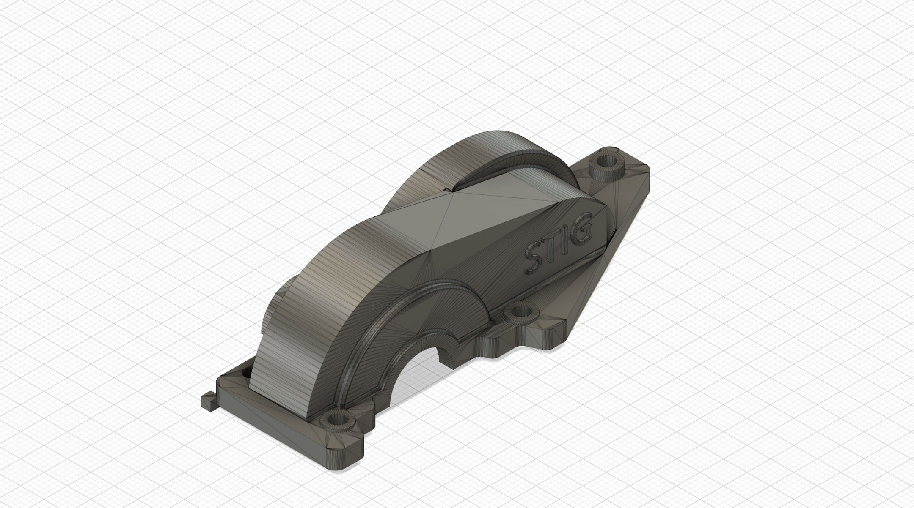

# TT02 Large Pinion Gear Cover

## Overview

This is a **gear cover** designed for the Tamiya TT02 chassis. This component is engineered to protect and contain the transmission while accommodating **larger spur and pinion gears**, allowing for additional flexibility around gear sizing while protecting the gears. 

**Warning:** This print requires rafters or supports to print successfully due to overhangs in the design. Ensure your slicer settings include adequate support structures to achieve the best print quality.

## Features

- Provides protective cover for the transmission area
- Supports installation of larger spur and pinion gears
- Compatible with Tamiya TT02 chassis
- Precision engineered for optimal fitment and clearance

## Files Included

- `large-pinion-gear-cover.f3d` - Fusion 360 design file for full design capabilities and modifications
- `large-pinion-gear-cover.step` - STEP format for universal CAD compatibility
- `large-pinion-gear-cover.stl` - STL file for 3D printing

