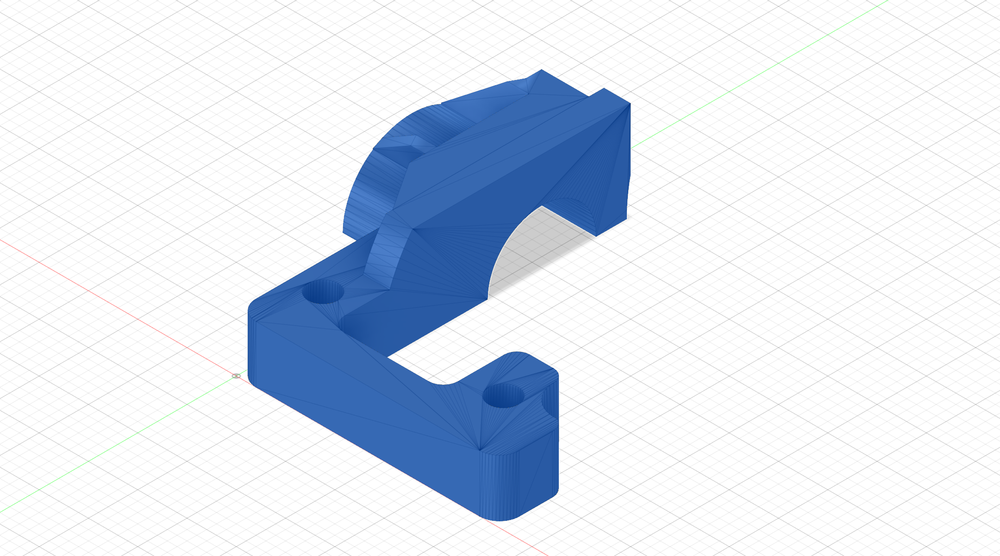

# TT02 Prop Shaft Bearing Holder - Rear

## Overview

This is a **prop shaft bearing stay** designed for the Tamiya TT02 rear end. This component is engineered to support and stabilize the prop shaft bearing, enabling the use of **larger spur and pinion gears** while maintaining proper stability of the prop shaft, connector, and bearing.

## Features

- Provides support for the rear prop shaft bearing when you can't fit the standard Tamiya gear cover due to larger gears
- Allows for increased gear sizes
- Compatible with Tamiya TT02 chassis
- Precision engineered for optimal fitment

## Files Included

- `TT02-Prop-Shaft-Bearing-Holder-Rear.f3d`  - Fusion 360 design file
- `TT02-Prop-Shaft-Bearing-Holder-Rear.step` - STEP format for compatibility with other CAD software
- `TT02-Prop-Shaft-Bearing-Holder-Rear.stl`  - STL file for 3D printing

